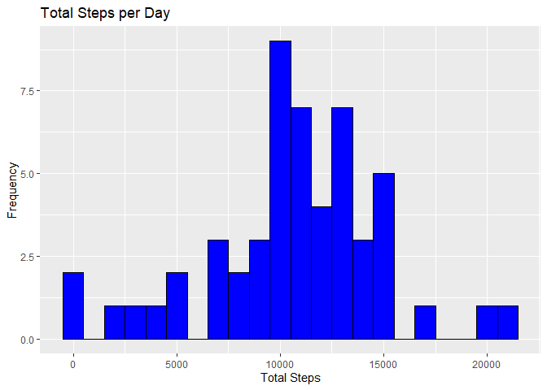
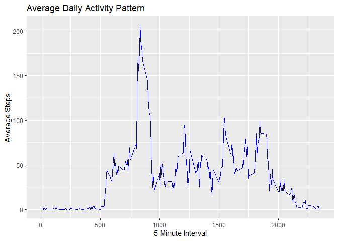
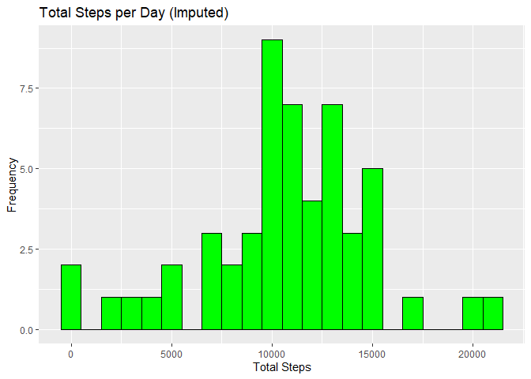
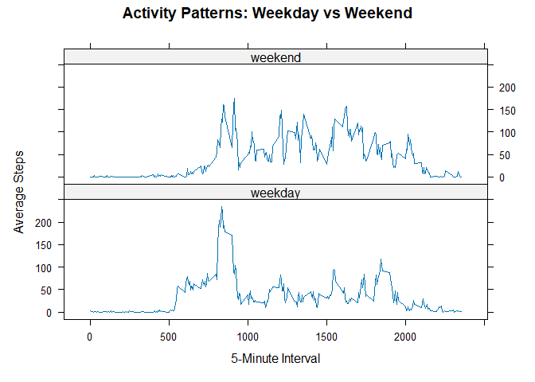

## **LOADING AND PREPROCESSING THE DATA**

###In this step, we will load the dataset, preprocess it, and prepare it
for analysis.

``` r
# Unzip the file
unzip("C:/Users/User/OneDrive/Desktop/PhD/R/RepData_PeerAssessment1/repdata_data_activity.zip", 
      exdir = "C:/Users/User/OneDrive/Desktop/PhD/R/RepData_PeerAssessment1/extracted_data")

# Load the CSV file from the extracted folder
data <- read.csv("C:/Users/User/OneDrive/Desktop/PhD/R/RepData_PeerAssessment1/extracted_data/activity.csv")

# Remove rows with missing values
data_clean <- data %>% filter(!is.na(steps))

# Check the data after preprocessing
head(data_clean)
```

    ##   steps       date interval
    ## 1     0 2012-10-02        0
    ## 2     0 2012-10-02        5
    ## 3     0 2012-10-02       10
    ## 4     0 2012-10-02       15
    ## 5     0 2012-10-02       20
    ## 6     0 2012-10-02       25

## **MEAN TOTAL NUMBER OF STEPS TAKEN PER DAY**

### Calculate the Total Number of Steps per Day and display histogram

``` r
# Calculate total steps per day
total_steps_per_day <- data_clean %>%
    group_by(date) %>%
    summarize(total_steps = sum(steps, na.rm = TRUE))

# View the first few rows of the data
head(total_steps_per_day)
```

    ## # A tibble: 6 × 2
    ##   date       total_steps
    ##   <chr>            <int>
    ## 1 2012-10-02         126
    ## 2 2012-10-03       11352
    ## 3 2012-10-04       12116
    ## 4 2012-10-05       13294
    ## 5 2012-10-06       15420
    ## 6 2012-10-07       11015

``` r
# Create histogram
ggplot(total_steps_per_day, aes(x = total_steps)) +
    geom_histogram(binwidth = 1000, fill = "blue", color = "black") +
    labs(title = "Total Steps per Day", x = "Total Steps", y = "Frequency")
```



``` r
# Calculate and report the mean and median of the total number of steps taken per day
mean_steps <- mean(total_steps_per_day$total_steps, na.rm = TRUE)
median_steps <- median(total_steps_per_day$total_steps, na.rm = TRUE)

mean_steps
```

    ## [1] 10766.19

``` r
median_steps
```

    ## [1] 10765

## **AVERAGE DAILY ACTIVITY PATTERN**

### Calculate the Average Steps per Interval

``` r
avg_steps_interval <- data_clean %>%
    group_by(interval) %>%
    summarize(avg_steps = mean(steps, na.rm = TRUE))

# View the first few rows of the data
head(avg_steps_interval)
```

    ## # A tibble: 6 × 2
    ##   interval avg_steps
    ##      <int>     <dbl>
    ## 1        0    1.72  
    ## 2        5    0.340 
    ## 3       10    0.132 
    ## 4       15    0.151 
    ## 5       20    0.0755
    ## 6       25    2.09

``` r
# Make a time series plot
ggplot(avg_steps_interval, aes(x = interval, y = avg_steps)) +
    geom_line(color = "blue") +
    labs(title = "Average Daily Activity Pattern",
         x = "5-Minute Interval",
         y = "Average Steps")
```



``` r
# Which 5-minute interval, on average across all the days in the dataset, contains the maximum number of steps?
max_interval <- avg_steps_interval[which.max(avg_steps_interval$avg_steps), ]
max_interval
```

    ## # A tibble: 1 × 2
    ##   interval avg_steps
    ##      <int>     <dbl>
    ## 1      835      206.

## **INPUTTING MISSING VALUES**

``` r
# Count total missing values in the dataset
total_na <- sum(is.na(data_clean$steps))
total_na
```

    ## [1] 0

``` r
# Calculate the average number of steps per interval (ignoring NAs)
avg_steps_interval <- data_clean %>%
    group_by(interval) %>%
    summarize(avg_steps = mean(steps, na.rm = TRUE))

# Create a new dataset with missing values imputed based on the average steps for the interval
data_clean_imputed <- data_clean
data_clean_imputed$steps <- ifelse(is.na(data_clean_imputed$steps),
                                    avg_steps_interval$avg_steps[match(data_clean_imputed$interval, avg_steps_interval$interval)],
                                    data_clean_imputed$steps)

# Calculate total steps per day in the imputed dataset
total_steps_per_day_imputed <- data_clean_imputed %>%
    group_by(date) %>%
    summarize(total_steps = sum(steps))

# Create a histogram of total steps per day in the imputed dataset
ggplot(total_steps_per_day_imputed, aes(x = total_steps)) +
    geom_histogram(binwidth = 1000, fill = "green", color = "black") +
    labs(title = "Total Steps per Day (Imputed)", x = "Total Steps", y = "Frequency")
```



``` r
# Calculate mean and median for total steps in the imputed dataset
mean_steps_imputed <- mean(total_steps_per_day_imputed$total_steps)
median_steps_imputed <- median(total_steps_per_day_imputed$total_steps)

mean_steps_imputed
```

    ## [1] 10766.19

``` r
median_steps_imputed
```

    ## [1] 10765

## **DIFFERENCES WEEKDAY VS WEEKEND**

``` r
# Create a new column "day_type" to indicate weekday or weekend
data_clean_imputed$day_type <- ifelse(weekdays(as.Date(data_clean_imputed$date)) %in% c("Saturday", "Sunday"),
                                       "weekend", "weekday")

# Calculate average steps for each 5-minute interval by day type (weekday/weekend)
avg_steps_day_type <- data_clean_imputed %>%
    group_by(interval, day_type) %>%
    summarize(avg_steps = mean(steps, na.rm = TRUE))
```

    ## `summarise()` has grouped output by 'interval'. You can override using the
    ## `.groups` argument.

``` r
# Create a panel plot to compare activity patterns on weekdays vs weekends
xyplot(avg_steps ~ interval | day_type, data = avg_steps_day_type, type = "l",
       layout = c(1, 2), 
       xlab = "5-Minute Interval",
       ylab = "Average Steps",
       main = "Activity Patterns: Weekday vs Weekend")
```


